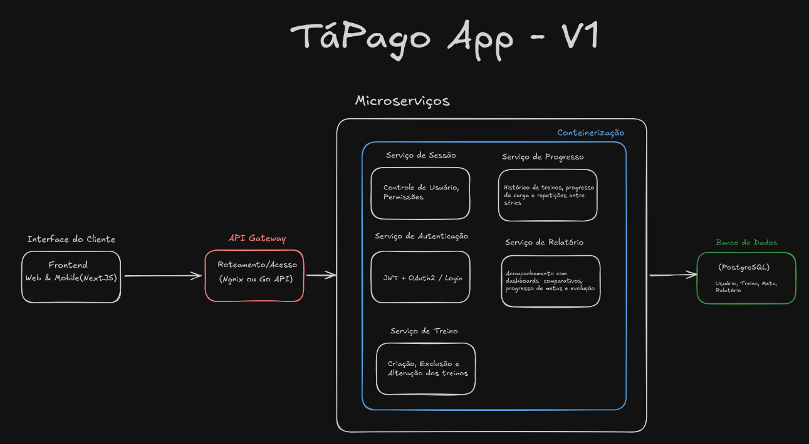

# Arquitetura baseada em Microserviços

A seguinte imagem demonstra uma Arquitetura de Microsserviços Containerizada com API Gateway e Frontend Desacoplado

O motivo da escolha de uma arquitetura de microserviços foi para termos um frontend desacoplado, mantendo módulos em relação aos serviços utilizados. Suportando tanto uma escalabilidade horizontal, quanto vertical.

